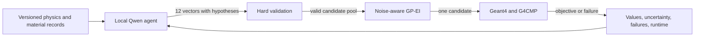
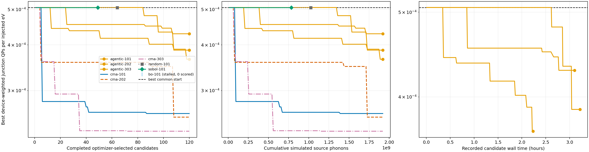

# Agentic material optimization for quantum-device phonon transport

This branch, `Agentic_Material_optimization`, adds a guarded local-LLM proposal
layer to `Material_optimization_v3_scan_parameters_revised`. A pinned Qwen model
proposes complete material-property vectors; deterministic code validates them,
a noise-aware Gaussian process ranks them, and Geant4/G4CMP alone supplies the
objective. The completed campaign used four GPUs on Mimir and evaluated three
agentic seeds with 120 successful candidates per seed.

The result is useful but not a win over the strongest traditional optimizer:
agentic search reduced the shared screening incumbent by a median 23.5%, while
CMA-ES reduced it by 49.9%. Agentic search beat random and Sobol in these
records, but its median best value remained 52.5% higher than the CMA-ES median.

## Result at a glance

| Quantity | Recorded result |
|---|---|
| Parent branch | `Material_optimization_v3_scan_parameters_revised` at `da7637f` |
| Search space | 14 continuous material parameters |
| Shared prior | 32 newly simulated points |
| Agentic campaign | 3 seeds × 120 successful candidates |
| Simulation failures | 3 among 363 attempts |
| Agent fallback | 0 candidates |
| Agentic median improvement | 23.5% from the shared incumbent |
| CMA-ES median improvement | 49.9% from the shared incumbent |
| Production model | `qwen3:235b-a22b-thinking-2507-q4_K_M` |
| Mimir deployment | 4 RTX A6000 GPUs; 65,536-token context; full GPU residency |
| Observed end-to-end runtime | about 12 h 42 min from first model trace to final result |
| Expected repeat runtime | 12–18 h under similar server load |

The four GPUs hosted the 142 GB language model. Geant4/G4CMP candidate
simulations used CPU workers, so adding model GPUs does not make simulation
tasks four times faster.

## Objective

Let the material vector be $x \in \mathcal X \subset \mathbb{R}^{14}$. For
spatial stratum $h$, sampled site $i$, transport replica $r$, and electrode $e$,
the screening objective is

$$
\widehat J(x) =
\sum_{h=1}^{H} W_h \frac{1}{n_h R}
\sum_{i \in h} \sum_{r=1}^{R}
\frac{\sum_e w_e Q_{e,i,r}(x)}{N_{\mathrm{task}} E_{\mathrm{gun}}},
\qquad
\sum_h W_h = \sum_e w_e = 1.
$$

$Q_{e,i,r}$ is the simulated quasiparticle count. The weights $W_h$ restore
the true device-area measure after near-electrode oversampling. The optimizer
solves

$$
x^* = \arg\min_{x \in \mathcal X} \widehat J(x)
\quad \text{subject to} \quad g_j(x) \leq 0.
$$

The constraints impose parameter bounds, cubic elastic stability, positive
transport constants, $v_T < v_L$, valid interface probabilities, and a
niobium-compatible film gap. The reported quantity is device-weighted junction
quasiparticles per injected eV, not logical-error probability.

For the common incumbent $J_0$, best-so-far screening improvement after $t$
completed proposals is

$$
I_t = 1 - \frac{\min\lbrace J_0,J_1,\ldots,J_t \rbrace}{J_0}.
$$

## Where agentic AI is used



For pool refresh $k$, the local model proposes

$$
P_k = \mathrm{LLM}(\mathcal K,\mathcal D_t,\mathcal F_t),
\qquad \lvert P_k \rvert = 12,
$$

where $\mathcal K$ is versioned project knowledge, $\mathcal D_t$ is measured
search history, and $\mathcal F_t$ is recorded failure and runtime feedback.
Deterministic code creates the admissible set

$$
\mathcal A_t =
\lbrace x \in P_k : x \in \mathcal X, g_j(x) \leq 0, x \notin \mathcal D_t \rbrace.
$$

After every observation, the GP is refit and reranks the remaining pool. For a
minimization problem,

$$
z_t(x) = \frac{J_{\min} - \mu_t(x) - \xi}{\sigma_t(x)},
$$

$$
\mathrm{EI}_t(x) =
\bigl[J_{\min} - \mu_t(x) - \xi\bigr]\Phi\bigl(z_t(x)\bigr) +
\sigma_t(x)\phi\bigl(z_t(x)\bigr),
$$

$$
x_{t+1} = \arg\max_{x \in \mathcal A_t} \mathrm{EI}_t(x).
$$

One twelve-vector pool is reused for up to twelve sequential evaluations. This
keeps the expensive 235B-model deployment manageable while preserving feedback:
new observations change the GP ranking before each selection. The remaining
pool is persisted so interrupted searches resume without regenerating an old
decision.

| Agent contribution | Deterministic control |
|---|---|
| Propose nonlocal parameter combinations | Reject malformed, duplicate, infeasible, and out-of-range vectors |
| Attach a short physical hypothesis | Fit the measured-noise GP and calculate expected improvement |
| Interpret prior successes and failures | Obtain values and standard errors only from Geant4/G4CMP |
| Label qualitative runtime risk | Enforce a 600 s per-task timeout and record failures |

The model cannot change bounds, constraints, objectives, seeds, event counts,
build identities, or confirmation rules. Exact prompts, responses, model
identity, selection provenance, and remaining pools are recorded for audit and
network-free replay.

## Why use an agent at all?

| Traditional method | Observed weakness | Agentic compensation | What remains unresolved |
|---|---|---|---|
| GP expected improvement | Its first widened-range proposal completed 0 of 512 tasks in 1 h | The prompt includes failed and slow regions; hard timeouts return failure evidence | The model's runtime label failed to identify two pathological proposals |
| CMA-ES | Synchronous generations and solutions concentrated on box faces | Semantic proposals can jump between different physical mechanisms | CMA-ES still found substantially lower screening values |
| Sobol and random | Broad sampling without measured feedback | The agent conditions proposals on values, uncertainty, and named material roles | LLM output is not mathematically guaranteed to explore evenly |
| Independent numerical coordinates | Feasible pseudo-materials may not be fabricable | Grounding supplies known material relations and explicit unknowns | Real-material projection and full-spatial confirmation remain mandatory |

The agent therefore changes candidate generation. It does not replace the
simulator, objective, feasibility checks, statistical estimator, or final
scientific review.

## Complete screening comparison

Every completed candidate below used the same experiment identity, common
32-point prior, and $1.6 \times 10^7$ source phonons. Agentic and CMA-ES each
have three 120-point seeds. Random has 64 points; Sobol stalled after 49; BO
stalled before scoring its first proposal.

The best common start was

$$
J_0 = (5.062199 \pm 0.873542) \times 10^{-4}.
$$

| Method and seed | Completed | Best $J \pm \mathrm{SE}$ | Improvement from $J_0$ | Failures |
|---|---:|---:|---:|---:|
| Agentic 101 | 120/120 | $(3.654020 \pm 0.536161) \times 10^{-4}$ | 27.8% | 1 |
| Agentic 202 | 120/120 | $(4.290081 \pm 0.625729) \times 10^{-4}$ | 15.3% | 0 |
| Agentic 303 | 120/120 | $(3.870108 \pm 0.600383) \times 10^{-4}$ | 23.5% | 2 |
| CMA-ES 101 | 120/120 | $(2.595938 \pm 0.557303) \times 10^{-4}$ | 48.7% | 0 |
| CMA-ES 202 | 120/120 | $(2.537300 \pm 0.525938) \times 10^{-4}$ | 49.9% | 0 |
| CMA-ES 303 | 120/120 | $(2.321996 \pm 0.429733) \times 10^{-4}$ | 54.1% | 0 |
| Random 101 | 64/64 | $(7.252207 \pm 0.996990) \times 10^{-4}$ | 0.0% best-so-far | 0 |
| Sobol 101 | 49/64 | $(7.566498 \pm 0.766528) \times 10^{-4}$ | 0.0% best-so-far | 0 |
| BO-GP 101 | 0/120 | no scored proposal | 0.0% best-so-far | stalled |

Across replicated equal-budget searches,

$$
\mathrm{median}(J_{\mathrm{agent}}) = 3.870108 \times 10^{-4},
$$

$$
\mathrm{median}(J_{\mathrm{CMA}}) = 2.537300 \times 10^{-4}.
$$

Thus the agentic median is 52.5% higher than the CMA-ES median. The result does
show that agentic proposals improved the common incumbent in all three seeds;
it does not show that agentic search outperforms CMA-ES.



The figure uses one fixed line color, style, and endpoint marker per run; each
legend sample is generated from the same plotted object. The first two panels
compare completed evaluations and equal source-phonon cost. The third panel
contains recorded candidate wall time only for agentic runs because the older
traditional records lack equivalent timing fields.

The agentic runs used a 600 s per-task censoring rule after two model proposals
were observed to make no task progress for hours. Traditional retained records
used no explicit task timeout. Objective values and completed-evaluation curves
remain comparable, but wall-time and failure efficiency are not equal-policy
evidence. The prompt also had access to earlier BO, Sobol, and aggregate CMA-ES
behavior, so this is a retrospective workflow comparison rather than a blinded
optimizer benchmark.

Machine-readable values and plot semantics are in
[`agentic-comparison-status.json`](material_scan/experiments/agentic-comparison-status.json)
and [`agentic-comparison-status.md`](material_scan/experiments/agentic-comparison-status.md).

## Runtime and deployment

The final estimate for this complete run was 12–18 h. The observed interval
from the first production model trace at 21:05 on 2026-09-21 to the final search
record at 09:47 on 2026-09-22 was about 12 h 42 min. This includes concurrent
seeds, model retries, diagnostic interruptions, three censored simulation
attempts, and 66 recorded model calls. A repeat should reserve 12–18 h because
LLM response time and pathological simulation regions vary.

The production identity was:

| Component | Pinned value |
|---|---|
| Model | `qwen3:235b-a22b-thinking-2507-q4_K_M` |
| Digest | `754a872f1290d6a685e7be7997962d6518823c32036358794b650db505f6bf99` |
| Ollama | `0.34.1` |
| Context | 65,536 tokens |
| Residency | 158,172,908,091 bytes fully resident across exactly four GPUs |
| Pool size | 12 |
| Model-call retries | 8 |
| Model timeout | 3,600 s |
| Simulation task timeout | 600 s |
| Attempt ceiling | 180 per 120 successful evaluations |

Run or resume one seed on Mimir with four explicit GPU UUIDs:

```bash
export AGENTIC_GPU_IDS="GPU-uuid-0,GPU-uuid-1,GPU-uuid-2,GPU-uuid-3"
export AGENTIC_MODEL_DIGEST="754a872f1290d6a685e7be7997962d6518823c32036358794b650db505f6bf99"
export AGENTIC_MODEL_TIMEOUT_SECONDS=3600
export AGENTIC_AGENT_RETRIES=8
export AGENTIC_TASK_TIMEOUT_SECONDS=600
export AGENTIC_MAX_ATTEMPTS=180

material_scan/scripts/run_agentic_mimir.sh \
  material_scan/experiments/material-search.yaml \
  material_scan_data/experiments/material-search/common/summary.json \
  material_scan_data/experiments/material-search/agentic-101 \
  101 120 60
```

Separate output directories are required for seeds 202 and 303. Repeating a
command resumes its saved pending decision and remaining candidate pool. Any
GP-only fallback is labelled and excluded from agentic evidence.

## Full-spatial confirmation

Screening winners are not final material conclusions. Traditional CMA-ES
finalists were already repeated with 2,361 sites, eight unused replicas, and
$5.9025 \times 10^8$ source phonons per point:

| Point | Confirmed $J \pm \mathrm{SE}$ | Paired change from compatible anchor |
|---|---:|---:|
| Compatible anchor | $(5.936004 \pm 0.209039) \times 10^{-4}$ | baseline |
| CMA-ES 101 | $(3.118155 \pm 0.132476) \times 10^{-4}$ | -47.5% |
| CMA-ES 202 | $(3.638355 \pm 0.155497) \times 10^{-4}$ | -38.7% |
| CMA-ES 303 | $(3.068781 \pm 0.180000) \times 10^{-4}$ | -48.3% |
| Agentic finalist | not run | unresolved |

Because the agentic screening median and even its best seed remain above all
three CMA-ES screening winners, this campaign provides no reason to claim a new
best material. An agentic finalist would require independent full-spatial
confirmation before any material conclusion. A sufficient paired criterion is

$$
U_{0.95}\bigl[J_{\mathrm{agent}} - J_{\mathrm{comparator}}\bigr] < 0,
$$

where $U_{0.95}$ is the upper bound of the declared 95% interval.

## Code and evidence map

| Path | Purpose |
|---|---|
| [`AGENTIC_MATERIAL_OPTIMIZATION_PLAN.md`](AGENTIC_MATERIAL_OPTIMIZATION_PLAN.md) | design, failure analysis, and comparison protocol |
| [`material_scan/agentic.py`](material_scan/agentic.py) | Ollama client, strict parsing, cached candidate pool, GP ranking, and replay |
| [`material_scan/agent_knowledge.md`](material_scan/agent_knowledge.md) | versioned project facts supplied to the agent |
| [`material_scan/scripts/run_agentic_mimir.sh`](material_scan/scripts/run_agentic_mimir.sh) | four-GPU launcher and production controls |
| [`material_scan/experiments/agentic-preflight.json`](material_scan/experiments/agentic-preflight.json) | model digest, context, and GPU-residency evidence |
| [`material_scan/experiments/agentic-comparison-status.json`](material_scan/experiments/agentic-comparison-status.json) | complete machine-readable comparison |
| [`material_scan/docs/results.md`](material_scan/docs/results.md) | broader scientific history and limitations |
| [`material_scan/docs/issues.yaml`](material_scan/docs/issues.yaml) | unresolved scientific gates |

Generated search states, raw model traces, and simulation outputs remain under
ignored `material_scan_data/`; compact comparison artifacts and exact
identities are versioned.

## Verification

```bash
conda run -n G4CMP python -m unittest discover -s material_scan/tests -v
conda run -n G4CMP python legacy/tests_stage4.py
```

The comparison report rejects mismatched experiment identities, mismatched
shared priors, mixed agent identities, and any agentic run containing a GP-only
fallback. The math in this README uses GitHub-supported dollar delimiters and
avoids unsupported macros such as `operatorname`.
