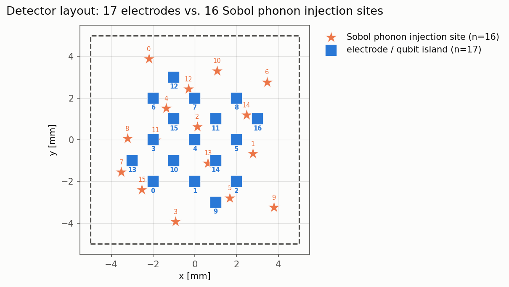
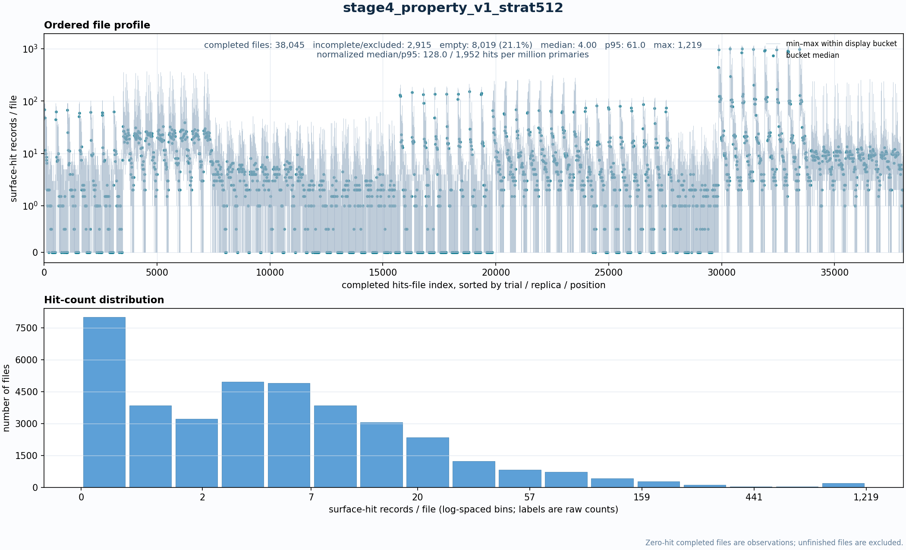
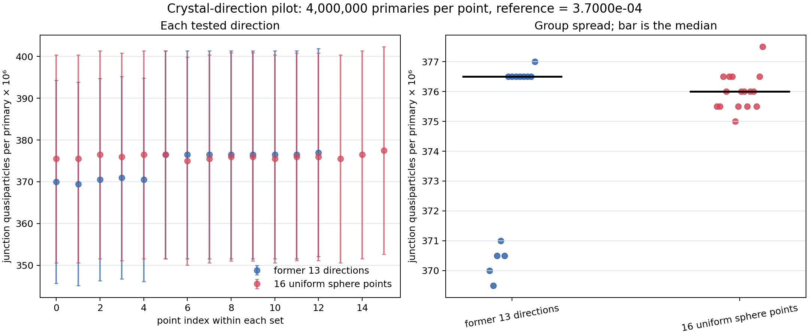

# Material-property optimization for phonon-mediated quasiparticles

This branch, `Material_optimization_v3_scan_parameters_revised`, scans
substrate and film properties to reduce phonon-mediated quasiparticle (QP)
production in a superconducting-qubit device. It also projects useful property
vectors onto real materials.

All numerical results below belong to this branch. The notation for the loss is
shared with `Agentic_Material_optimization`; no optimization result from that
branch is used here.

## Loss being minimized

Let the material-property vector be $x\in\mathcal X\subset\mathbb R^d$. For
injection position $\xi$, phonon-transport realization $\omega$, and electrode
$e$, let $Q_e(x,\xi,\omega)$ be the QPs delivered to electrode $e$ by one
source phonon. The simulation defines the map

$$
J:\mathcal X\rightarrow\mathbb R_{\geq 0},
\qquad
J(x)=\mathbb E_{\xi,\omega}\left[
\frac{1}{E_{\mathrm{gun}}}\sum_e w_eQ_e(x,\xi,\omega)
\right],
\qquad \sum_e w_e=1,
$$

where $E_{\mathrm{gun}}=10\,\mathrm{meV}$ and $w_e$ is the fixed importance
of electrode $e$. The material search solves

$$
x^*=\arg\min_{x\in\mathcal X}J(x)
\quad\mathrm{subject\ to}\quad g_j(x)\leq 0,
$$

where $g_j$ impose cubic elastic stability, positive transport quantities,
$v_T<v_L$, physical interface probabilities, and any declared film-gap limit.
The loss is device-weighted junction QPs per injected eV, not logical-error
probability.

Earlier 16-position experiments instead report the summed junction yield

$$
Y_{\mathrm{sum}}(x)=
\mathbb E_{\xi,\omega}\left[\sum_{e=1}^{N_e}Q_e(x,\xi,\omega)\right]
$$

in QPs per primary. With uniform electrode weights and the same injection
measure, $Y_{\mathrm{sum}}=N_eE_{\mathrm{gun}}J$, where $N_e=17$. This constant
factor preserves rankings within one experiment. Magnitudes from the old and
new tables are not directly comparable because the spatial measures also
differ.

For spatial region $h$ with true area fraction $W_h$, $n_h$ sampled positions,
$R$ realizations, and $N_{\mathrm{task}}$ source phonons per simulation task,
the device-area estimator is

$$
\widehat J(x)=
\sum_h W_h\frac{1}{n_hR}
\sum_{i\in h}\sum_{r=1}^{R}
\frac{\sum_e w_eQ_{e,i,r}(x)}
{N_{\mathrm{task}}E_{\mathrm{gun}}},
\qquad \sum_hW_h=1.
$$

The $W_h$ factors restore the physical device-area measure after deliberately
sampling more positions near electrodes. An equal mean over sampled positions
would be biased. The reported upper-tail response is kept as a diagnostic, not
an enforced limit, because no independent engineering threshold exists.

## Device and spatial sampling

The early studies used 16 common Sobol injection positions and 17 electrodes:



That design was useful for comparisons but not for a device-area average. One
position supplied about half of the reference response. Injection at an exact
electrode centre also produced 43 times the response of another point in the
same footprint and inflated the estimated on-electrode mean by a factor of 24.

The corrected design samples five regions defined by distance from the exact
$10\,\mu\mathrm m\times10\,\mu\mathrm m$ electrode rectangles. Each footprint
gets a uniform interior point rather than its centre. Candidate and reference
use the same positions, random-number sequences, event count, and $W_h$.

## Results

### 1. Linked real-material screen

All 18 combinations of three substrates (Si, Ge, GaAs), three upper films
(Nb, Ta, Ti), and two lower films (Cu, Au) were simulated. Each combination
used 4,000,000 primaries, 16 positions, and two realizations.

| Finding | Revised-branch result |
|---|---:|
| Matched Cu versus Au comparisons | Cu lower in 9/9 |
| Nominal best combination | GaAs/Nb/Cu |
| GaAs/Nb/Cu versus Si/Nb/Cu | -39.5% |
| Ge/Nb/Cu versus GaAs/Nb/Cu | +1.9%; unresolved |

This experiment ranks linked property sets. It does not show that one material
constant caused the reduction.

### 2. Continuous-property optimizer comparison

The corrected comparison gave each method 96 evaluated points, 4,000,000
primaries per point, 16 positions, and eight realizations.

| Method | Best $Y_{\mathrm{sum}}$ | Median $Y_{\mathrm{sum}}$ | Points below $1.15\times10^{-4}$ |
|---|---:|---:|---:|
| Gaussian-process expected improvement | $5.60\times10^{-5}$ | $1.08\times10^{-4}$ | 50/96 |
| CMA-ES | $5.30\times10^{-5}$ | $1.64\times10^{-4}$ | 28/96 |
| Sobol | $7.35\times10^{-5}$ | $3.62\times10^{-4}$ | 2/96 |
| Random | $1.02\times10^{-4}$ | $4.02\times10^{-4}$ | 1/96 |

The adaptive methods sampled low-response regions much more often than Sobol
or random sampling. Gaussian-process search and CMA-ES are not resolved from
each other: only one independent run was made for each, and their best values
overlap statistically. The exact summary is in
[`stage4_report.json`](data/results/stage4_report.json).

The unconstrained minima are not credible device materials because several
parameters lie on search limits and the upper-film gap implies a critical
temperature near 0.33 K. Requiring
$\Delta_{\mathrm{film}}\geq1.5384\times10^{-3}\,\mathrm{eV}$ retains 69 of 402
measured points. The best retained point has
$Y_{\mathrm{sum}}=(6.55\pm1.24)\times10^{-5}$, 24% above the unconstrained minimum, but still
touches five search limits. It is a useful starting point, not a real material.

### 3. Corrected projection onto real materials

An earlier projection used silicon density for several non-silicon labels.
The corrected calculation preserves each selected Geant4 material, measured
density, lattice record, and measured elastic constants.

| Candidate | Change in $Y_{\mathrm{sum}}$ from reference | Fraction of ideal reduction |
|---|---:|---:|
| Ideal property target | -70.0% | 100% |
| SiC elastic constants | -53.3% | 76.2% |
| Be$_2$C elastic constants | -52.0% at 32,000,000 primaries | 73.6% |
| GaAs/Nb/Cu | -31.2% | 44.6% |

These values use the older 16-position loss. They are material-screening
results, not converged device averages. Varying SiC's unsourced scattering and
decay constants across the measured G4CMP range changed the recovered fraction
from 73.8% to 76.9%; the true SiC constants are still required before a
fabrication claim. See
[`stage4_projection_corrected.json`](data/results/stage4_projection_corrected.json).

### 4. Spatial integration

The corrected nested study uses 128, 256, and 512 positions, eight
realizations, and 31,250 source phonons per position-realization task. Table
entries are $\widehat J$ in weighted junction QPs per injected eV.

| Property vector | 128 positions | 256 positions | 512 positions |
|---|---:|---:|---:|
| Reference | $2.4292\times10^{-3}$ | $2.3980\times10^{-3}$ | $2.4155\times10^{-3}$ |
| SiC-elasticity test | $1.0871\times10^{-3}$ | $1.1764\times10^{-3}$ | $1.2561\times10^{-3}$ |
| Niobium-gap-compatible point | $3.9432\times10^{-4}$ | $4.6706\times10^{-4}$ | $4.4877\times10^{-4}$ |
| Ideal target | $8.1515\times10^{-4}$ | $8.0900\times10^{-4}$ | $8.3134\times10^{-4}$ |

Reference, ideal-target, and niobium-compatible totals are stable from 256 to
512 positions under the declared checks. SiC changes by 6.3%, and three
spatial regions still fail their separate checks. Therefore this branch does
not yet claim spatial convergence.

Completed files at 512 positions contain a median of four surface-hit rows;
about 21% are valid physical-zero files. Normalized hit counts remain stable by
spatial region, so there is no evidence for a general missing-hit failure.



Raw hit rows are not independent primary events. This plot diagnoses output
quality; it does not by itself determine the uncertainty of $\widehat J$.

### 5. Continuous crystal direction

The direction pilot compared the former 13 integer directions with 16 sphere
points while holding all material properties fixed. All 29 unique simulations
and 3,712 tasks completed.

| Direction set | Minimum $Y_{\mathrm{sum}}$ | Median $Y_{\mathrm{sum}}$ | Maximum $Y_{\mathrm{sum}}$ |
|---|---:|---:|---:|
| Former 13 directions | $3.695\times10^{-4}$ | $3.765\times10^{-4}$ | $3.770\times10^{-4}$ |
| 16 sphere points | $3.750\times10^{-4}$ | $3.760\times10^{-4}$ | $3.775\times10^{-4}$ |

The median changes by -0.13%, whereas one-point relative uncertainty is about
6.6%. No directional improvement is resolved. Two continuous sphere
coordinates remain preferable because they represent the physical search space
without restricting it to 13 hand-picked directions.



The checked values are in the
[`orientation-pilot summary`](material_scan/experiments/orientation-pilot/summary.json).

## Defensible conclusions

1. Cu outperforms Au in every matched linked-material comparison under this
   model.
2. Gaussian-process search and CMA-ES find low-response vectors more often than
   random or Sobol sampling, but this branch does not resolve which adaptive
   method is better.
3. The direct niobium-compatible film-gap limit is necessary; the unconstrained
   minimum is not a credible device design.
4. Corrected SiC elastic constants remain promising, but the quoted reduction
   uses the older 16-position loss and assumed phonon constants.
5. Geometry-aware area weighting fixes the known electrode-centre and
   equal-position biases, but the 512-position calculation is not yet fully
   converged.
6. No fabricable optimum or logical-error reduction has been established.

## Recommended next experiments

1. Add nested positions only in the three spatial regions that failed, keeping
   31,250 source phonons per task and paired random-number sequences.
2. Obtain SiC scattering, total decay, and transverse-transverse decay values
   from literature or first-principles calculation.
3. Fix operating temperature, impose the direct niobium-compatible gap limit,
   and define physically supported ranges around the best compatible point.
4. Re-evaluate diverse compatible points with the final spatial definition,
   then run at least three independent Gaussian-process and CMA-ES searches
   with equal numbers of evaluated points.
5. Confirm leading feasible points using unused random-number sequences;
   bracket film lifetimes and test an independently justified interface model
   before recommending fabrication.

## Repository map

| Path | Purpose |
|---|---|
| [`material_scan/`](material_scan/) | current definitions, analysis, tests, and reports |
| [`material_scan/docs/science.md`](material_scan/docs/science.md) | physical assumptions and equations |
| [`material_scan/docs/results.md`](material_scan/docs/results.md) | complete experiment history and cautions |
| [`material_scan/docs/data.md`](material_scan/docs/data.md) | result preservation and recovery |
| [`legacy/`](legacy/) | retained simulation and earlier analysis path |
| [`data/`](data/) | preserved simulations, result files, and SQLite records |

The current `material_scan` execution path still refuses to launch Geant4 until
its material and macro rendering are fully compared with the retained path.
Use `legacy/` only for controlled comparison work, not as the starting point
for new code.

## Verification

Run from the repository root in the existing G4CMP Conda environment:

```bash
conda run -n G4CMP python -m unittest discover -s material_scan/tests -v
conda run -n G4CMP python legacy/tests_stage4.py
```

The Geant4 executable, G4CMP source, and G4CMP data are external installations.
Record their exact identities for every new simulation.
