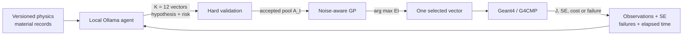
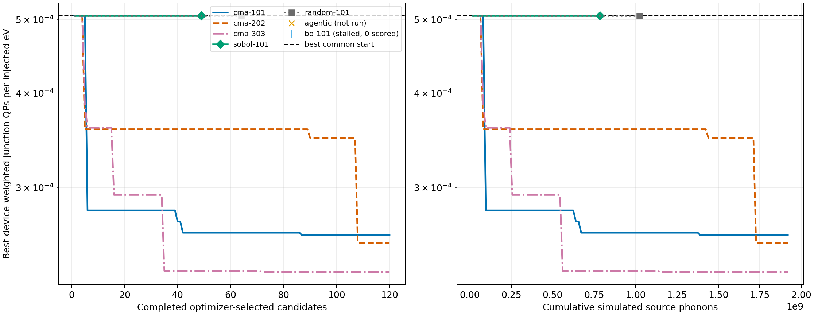

# Agentic material optimization for quantum-device phonon transport

This branch, `Agentic_Material_optimization`, extends
`Material_optimization_v3_scan_parameters_revised` with a guarded local-LLM
proposal layer for the existing Geant4/G4CMP material search. The agent proposes
material-property vectors and physical hypotheses; deterministic code enforces
the experiment, a Gaussian process ranks valid proposals, and Geant4/G4CMP is
the only source of objective values.

The current evidence is a successful four-GPU deployment and one equal-policy
pilot point. It is **not** a completed agentic-versus-traditional benchmark.

## Status

| Item | Recorded state |
|---|---|
| Parent branch | `Material_optimization_v3_scan_parameters_revised` at `da7637f` |
| Search dimension | $d=14$ continuous material properties |
| Common prior | 32 newly simulated starting points |
| Screening cost | 128 sites $\times$ 4 replicas $\times$ 31,250 phonons $=1.6\times10^7$ phonons/candidate |
| Production agent | `qwen3:235b-a22b-thinking-2507-q4_K_M` |
| Model identity | digest `754a872f…6bf99`, Ollama `0.34.1` |
| Mimir deployment | 4 RTX A6000 GPUs, 65,536-token context, 100% GPU residency |
| Agentic pilot | 1/1 candidate complete; 12/12 pool proposals valid; no fallback |
| Full agentic comparison | 0/3 seeds complete; $3\times120$ points pending |
| Present conclusion | deployment works; no resolved agentic improvement |

The model choice favors a large open-weight reasoning model with strong science,
tool-use, and materials-science results: the Qwen card specifies 235B total and
22B activated parameters, while MatSciBench reports 73.37% text-only accuracy
for the Qwen3-235B-A22B family. The exact Ollama Q4 artifact is not independently
benchmarked, so model knowledge is never accepted as physical evidence.

- [Qwen3-235B Thinking model card](https://huggingface.co/Qwen/Qwen3-235B-A22B-Thinking-2507)
- [exact 142 GB Ollama artifact](https://ollama.com/library/qwen3%3A235b-a22b-thinking-2507-q4_K_M)
- [MatSciBench](https://arxiv.org/html/2510.12171v2)

## Optimization target

For material vector $x\in\mathcal X\subset\mathbb R^{14}$, spatial stratum
$h$, sampled site $i$, transport replica $r$, and electrode $e$, the screening
estimator is

$$
\widehat J(x)=
\sum_{h=1}^{H}W_h\frac{1}{n_hR}
\sum_{i\in h}\sum_{r=1}^{R}
\frac{\sum_e w_eQ_{e,i,r}(x)}{N_{\mathrm{task}}E_{\mathrm{gun}}},
\qquad
\sum_hW_h=\sum_ew_e=1.
$$

Here $Q_{e,i,r}$ is the simulated quasiparticle count and $W_h$ restores the
true device-area measure after deliberate near-electrode oversampling. The
optimizer solves

$$
x^*=\arg\min_{x\in\mathcal X,\;g_j(x)\le0}\widehat J(x),
$$

subject to bounds, cubic elastic stability, positive transport constants,
$v_T<v_L$, valid interface probabilities, and the niobium-compatible film-gap
constraint. $J$ is weighted junction quasiparticles per injected eV, not a
logical-error probability.

For a common incumbent $J_0$, reported screening improvement is

$$
I_t=1-\frac{\min(J_0,J_1,\ldots,J_t)}{J_0}.
$$

## Where the agent is used



At iteration $t$, the local model proposes a pool

$$
P_t=\mathrm{LLM}\,(\mathcal K,\mathcal D_t,\mathcal F_t),
\qquad |P_t|=12,
$$

and deterministic code forms

$$
A_t=\{x\in P_t:x\in\mathcal X,\ g_j(x)\le0,\ x\notin\mathcal D_t\}.
$$

The existing heteroscedastic GP then selects

$$
x_{t+1}=\arg\max_{x\in A_t}\mathrm{EI}_t(x),
$$

where, for minimization,

$$
z=\frac{J_{\min}-\mu_t(x)-\xi}{\sigma_t(x)},\qquad
\mathrm{EI}_t(x)=
(J_{\min}-\mu_t(x)-\xi)\Phi(z)+\sigma_t(x)\phi(z).
$$

The LLM's runtime-risk label is recorded and returned as feedback; it does not
override validation or the GP score. The LLM cannot change bounds, constraints,
seeds, event counts, objectives, build identities, or confirmation rules.

| Agent responsibility | Deterministic responsibility |
|---|---|
| Propose non-local parameter combinations | Reject missing, nonfinite, duplicate, infeasible, or out-of-range vectors |
| State a short physical hypothesis | Rank accepted vectors with measured-noise GP-EI |
| Flag likely runtime risk from recorded failures | Persist the ask before simulation and resume it exactly |
| Revise proposals after measured feedback | Obtain $J$, standard error, and cost only from Geant4/G4CMP |

The implementation is concentrated in
[`material_scan/agentic.py`](material_scan/agentic.py), with grounded project
facts in [`agent_knowledge.md`](material_scan/agent_knowledge.md). Exact prompts,
responses, validation errors, model digest, and selections are saved for audit
and network-free replay.

## Why add the agent

| Traditional behavior | Observed limitation | Agentic compensation | Remaining limitation |
|---|---|---|---|
| GP expected improvement | First revised BO point completed 0/512 tasks in 1 h; projected $\ge8.53$ h/candidate | Prompt includes failed/slow regions; pool carries runtime hypotheses | Runtime risk is not yet a calibrated cost model |
| CMA-ES | Good minima, but synchronous generations and repeated box-face solutions | Semantic proposals can jump between physical mechanisms | GP still ranks a noisy, finite LLM pool |
| Sobol/random | Broad coverage without feedback | Agent uses observations and named parameter roles | LLM output remains nondeterministic, even at $T=0$ |
| All numerical methods | Independent coordinates can describe non-fabricable pseudo-materials | Agent is grounded in project material records and explicit unknowns | Fabricability still requires real-material projection and confirmation |

Agentic optimization therefore changes **candidate generation**, not the
physics model or acceptance standard.

## Screening comparison

All numeric rows below share the same experiment identity, 32-point prior, and
$1.6\times10^7$ source phonons per completed candidate. Budgets differ: the
agentic row is a one-point deployment pilot, while CMA-ES has 120 points per
seed. Consequently, the table is descriptive rather than an equal-budget rank.
“Traditional” denotes the optimizers inherited from
`Material_optimization_v3_scan_parameters_revised` and their retained
same-identity run records; “Agentic” denotes the added proposal layer in this
branch.

Let $J_0=(5.062199\pm0.873542)\times10^{-4}$ be the best common start.

| Branch lineage | Method | Completed | Best new $J\pm\mathrm{SE}$ | Best-so-far $J$ | $I_t$ | Result |
|---|---|---:|---:|---:|---:|---|
| Agentic | Qwen pool $\rightarrow$ GP-EI | 1/1 | $(5.395803\pm0.830765)\times10^{-4}$ | $5.062199\times10^{-4}$ | 0.0% | New point is 6.59% worse; intervals overlap |
| Traditional | CMA-ES, seed 101 | 120/120 | $(2.595938\pm0.557303)\times10^{-4}$ | $2.595938\times10^{-4}$ | 48.7% | Improved |
| Traditional | CMA-ES, seed 202 | 120/120 | $(2.537300\pm0.525938)\times10^{-4}$ | $2.537300\times10^{-4}$ | 49.9% | Improved |
| Traditional | CMA-ES, seed 303 | 120/120 | $(2.321996\pm0.429733)\times10^{-4}$ | $2.321996\times10^{-4}$ | 54.1% | Improved |
| Traditional | random, seed 101 | 64/64 | $(7.252207\pm0.996990)\times10^{-4}$ | $5.062199\times10^{-4}$ | 0.0% | Did not beat prior |
| Traditional | Sobol, seed 101 | 49/64 | $(7.566498\pm0.766528)\times10^{-4}$ | $5.062199\times10^{-4}$ | 0.0% | Point 50 stalled |
| Traditional | BO-GP, seed 101 | 0/120 | — | $5.062199\times10^{-4}$ | 0.0% | First point stalled; no score assigned |

The agentic pilot gives

$$
1-\frac{J_{\mathrm{agent},1}}{J_0}=-0.0659,
$$

so its selected point is numerically worse and the incumbent remains $J_0$.
One point cannot establish either a regression or optimizer superiority.

### Traditional result before the agentic pilot



### Agentic branch overlay


The orange marker is the one-point agentic best-so-far value; the orange cross
denotes the pending full agentic campaign. The third panel contains wall time
only where the retained record includes it. Full data and plot semantics are in
[`agentic-comparison-status.md`](material_scan/experiments/agentic-comparison-status.md).

## Full-spatial confirmation

Screening winners are not material conclusions. Traditional CMA-ES finalists
were repeated with 2,361 sites, eight unused replicas, and
$5.9025\times10^8$ source phonons per point:

| Point | Confirmed $J\pm\mathrm{SE}$ | Paired change from compatible anchor |
|---|---:|---:|
| Compatible anchor | $(5.936004\pm0.209)\times10^{-4}$ | — |
| CMA-ES seed 101 | $(3.118155\pm0.132)\times10^{-4}$ | $-47.5\%$ |
| CMA-ES seed 202 | $(3.638355\pm0.155)\times10^{-4}$ | $-38.7\%$ |
| CMA-ES seed 303 | $(3.068781\pm0.180)\times10^{-4}$ | $-48.3\%$ |
| Agentic | not run | not resolved |

An agentic improvement may be claimed only after all three 120-point seeds and
a paired full-spatial comparison satisfy

$$
\sup\,\mathrm{CI}_{95\%}\!\left[J_{\mathrm{agent}}-J_{\mathrm{comparator}}\right]<0.
$$

## Running the agentic search on Mimir

The production launcher requires exactly four explicit GPU UUIDs for the 142 GB
model, pins the full digest, disables Vulkan/cloud fallback, checks the requested
context and exact GPU residency, and keeps simulation workers independent of
model GPUs.

```bash
export AGENTIC_GPU_IDS="GPU-uuid-0,GPU-uuid-1,GPU-uuid-2,GPU-uuid-3"
export AGENTIC_MODEL_DIGEST="754a872f1290d6a685e7be7997962d6518823c32036358794b650db505f6bf99"

material_scan/scripts/run_agentic_mimir.sh \
  material_scan/experiments/material-search.yaml \
  material_scan_data/experiments/material-search/common/summary.json \
  material_scan_data/experiments/material-search/agentic-101 \
  101 120 60
```

Repeating the same command resumes the recorded pending decision; it does not ask
the model to regenerate an earlier proposal. Seeds 202 and 303 use separate
output directories. A fallback proposal is excluded from agentic evidence.

## Reproducibility and evidence

| Path | Purpose |
|---|---|
| [`AGENTIC_MATERIAL_OPTIMIZATION_PLAN.md`](AGENTIC_MATERIAL_OPTIMIZATION_PLAN.md) | design rationale, failure analysis, comparison protocol |
| [`material_scan/agentic.py`](material_scan/agentic.py) | Ollama client, strict parser, candidate guard, GP ranking, replay |
| [`material_scan/scripts/run_agentic_mimir.sh`](material_scan/scripts/run_agentic_mimir.sh) | isolated one-to-four-GPU launcher; production model requires four |
| [`material_scan/experiments/agentic-preflight.json`](material_scan/experiments/agentic-preflight.json) | checked model, digest, context, and residency evidence |
| [`material_scan/experiments/agentic-comparison-status.json`](material_scan/experiments/agentic-comparison-status.json) | machine-readable comparison |
| [`material_scan/docs/results.md`](material_scan/docs/results.md) | scientific results and unresolved questions |
| [`material_scan/docs/science.md`](material_scan/docs/science.md) | objective, spatial estimator, constraints, and model scope |
| [`material_scan/docs/issues.yaml`](material_scan/docs/issues.yaml) | open gates that prevent stronger claims |
| [`data/README.md`](data/README.md) | preserved historical evidence and recovery |

Run the current and retained regression suites in the `G4CMP` environment:

```bash
conda run -n G4CMP python -m unittest discover -s material_scan/tests -v
conda run -n G4CMP python legacy/tests_stage4.py
```

The current branch passes 86/86 package tests and 194/194 retained Stage-4
gates. The Ollama server used for the pilot was stopped after validation; model
weights remain under ignored `material_scan_data/ollama/`.

## Interpretation

- The agentic execution path is production-capable on four A6000 GPUs.
- The single agent-selected candidate did **not** improve the common incumbent.
- CMA-ES is the only method here with replicated 120-point screening gains and
  paired full-spatial confirmation.
- BO and Sobol expose the value of runtime-aware proposals, but the current
  agentic risk label is qualitative rather than a learned cost acquisition.
- The next defensible comparison is agentic seeds $101,202,303$, each with 120
  completed points, followed by unused-seed 2,361-site confirmation only for a
  competitive finalist.
