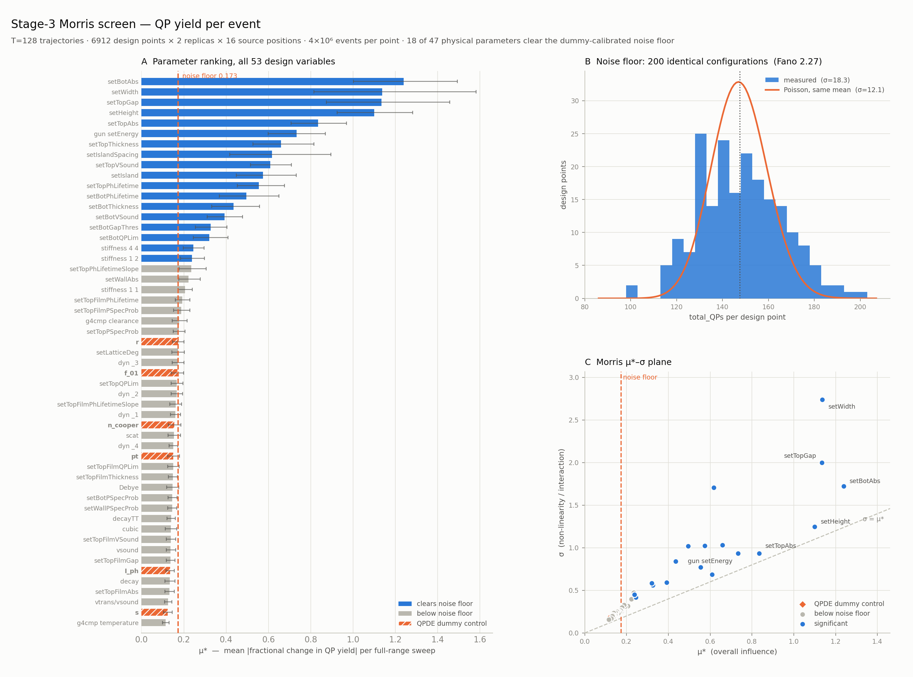

# Results: stage 1 → stage 3 (2026-07-28)

Screening run `morris_mimir_c7a18a17-91ce-491b-8124-78a4ff16576a`, with its
noise-floor companion `morris_mimir_f52fb742-8b08-4ecf-9e46-d869a77750cd`.

> **Revised 2026-07-28** following an independent audit
> ([`AUDIT_RESULTS_stage1_to_stage3.md`](AUDIT_RESULTS_stage1_to_stage3.md)).
> All 14 of its concerns were reproduced and are addressed here. The three
> substantive changes: the discovery count is **18, not 20** (the threshold's
> own uncertainty is now propagated); `setIsland`/`setIslandSpacing` are
> **backside absorber controls, not qubit geometry**; and the claim that
> `clock()` seeding was safe is **retracted** — streams were being reused.

**Headline.** 18 of 47 physical parameters produce a QP-yield effect
distinguishable from Monte-Carlo noise. The strongest is `setBotAbs`, the
backside phonon absorber, and it heads a coherent backside-mitigation group
(absorption, island coverage and pitch, thickness, sound speed, phonon
lifetime) that acts as one coupled system. Alongside it sit the aluminium gap
`setTopGap` and the Si→Al phonon transmission `setTopAbs`. The previous
configuration could resolve nothing at all — its ranking was noise.



*(Tracked copy. `stage3_plot_results.py` writes into the run directory by
default — which is gitignored — so the committed copy lives in `figures/`;
regenerate it with `--out figures/stage3_screen_results.png`.)*

---

## 0. What μ* means

Morris sensitivity is built from **elementary effects**. Take a design point
`x`, move exactly one parameter *i* by a step Δ, and measure how the objective
responds:

```
EE_i = [ y(x + Δ·e_i) − y(x) ] / Δ
```

Each Morris trajectory walks through the design box changing one parameter per
step, so one trajectory yields one `EE` per parameter. With T trajectories you
get T elementary effects per parameter, and:

| Index | Definition | Reads as |
|---|---|---|
| **μ** | mean of the *signed* `EE` | net direction of the effect |
| **μ\*** | mean of the **absolute** \|`EE`\| | **overall influence, regardless of sign** |
| **σ** | standard deviation of the signed `EE` | non-linearity and interaction |

**Why μ\* rather than μ.** A parameter whose effect is positive in one region
of the design box and negative in another averages to μ ≈ 0 and looks
irrelevant, even though it moves the objective a great deal. Taking the
absolute value first removes that cancellation. (μ\* is Campolongo, Cariboni &
Saltelli's "modified mean", 2007.)

**What σ adds.** If a parameter acts linearly and independently, every
trajectory sees the same effect and σ is small. Large σ relative to μ\* means
the effect *depends on where you are* in the design box — non-linearity or
interaction with other parameters. Panel C of the figure is this plane: points
far above the σ = μ\* diagonal are interaction-driven. `setWidth` (μ\* = 1.14,
σ = 2.74) is the extreme case here.

**Units — this matters, and it is where a first version of this analysis went
wrong.** Raw `EE = Δy/Δx` carries the units of *x*. Across this design the
parameter scales span ~1e-5 (`r`) to ~1e9 (`f_01`), so raw μ\* values differed
by 15 orders of magnitude for reasons having nothing to do with influence, and
were not comparable between parameters. In `stage3_screen_analysis.py` both
axes are therefore normalised:

* x by each parameter's own sampled range → a step is a fraction of that
  parameter's full sweep;
* y by the mean objective → an effect is a fractional change in QP yield.

So **μ\* = 1.24 for `setBotAbs` means: sweeping it across its full range
changes QP yield by ~124% of the mean, on average.** That is on the same scale
as the 53% single-comparison resolution from the noise floor — but note μ\* is
an average over 128 trajectories, so the screen detects systematic effects
*below* 53%; the dummy threshold, not 53%, is what decides significance.

**μ\* has no zero.** Under pure noise the elementary effects are centred on
zero, but μ\* averages their absolute value, and `E|N(0,σ)| = σ√(2/π) > 0`. So
a parameter with *exactly zero* true effect still earns a positive μ\*, and a
ranking will happily order pure noise. Hence the dummy-parameter threshold in
§3.2 — μ\* must be compared against what noise alone earns, never against zero.

---

## 1. Stage 1 — simulation

### 1.1 Configuration, and what changed from the previous run

| Parameter | Previous | Current | Reason |
|---|---|---|---|
| `/main/gun/setEnergy` | [191, 573] µeV | **[0.6, 1.5] meV** | Two of four Morris levels sat below the 2Δ pair-breaking gate, so ~47% of the design simulated nothing. Floor = 2Δ_Al at the top of the `setTopGap` sweep; ceiling set by transport (isotope MFP 137 µm at 1.5 meV vs a 525 µm substrate). |
| `/g4cmp/minEPhonons` | 382 µeV | **38.2 µeV** | It sat *above* the lowest physical threshold in the design (2Δ_Al = 191 µeV at the bottom of the gap sweep), so a numerical cut preempted a physical one. |
| `vtrans` | absolute, [2700, 8100] m/s | **ratio v_T/v_L ∈ [0.3, 0.9]** | Independent sweeps let v_T exceed v_L, which is not a crystal; it also crashed G4CMP (§1.3). |
| Sampling per design point | 1 run, 1 fixed position | **16 Sobol positions × 2 replicas** | Si phonon focusing is anisotropic — one site measures one caustic, not the device. |

Event accounting (a design point is no longer one run):

| Level | Events |
|---|---|
| `/run/beamOn` per macro | **125,000** |
| Per replica (16 positions pooled) | 2,000,000 |
| **Per design point** (× 2 replicas) | **4,000,000** |
| Whole run (× 6912 points) | 2.76 × 10¹⁰ |

The 125,000 comes from `SENSITIVITY_EVENTS_PER_POSITION`, **not** from
`sensitivity_template_screen.mac`, whose `/run/beamOn 200000` is an inert
placeholder that stage 1 overwrites in every generated macro. See the README's
"Phonon event accounting".

Positions are **identical across all design points** — a common random number,
so position variance cancels in the elementary-effect differences instead of
inflating them. Replicas are independent CLHEP realisations and are kept
*separate* in the manifest, so their spread measures noise.

### 1.2 Run statistics

| | |
|---|---|
| Design | T=128, 6912 points × 2 replicas × 16 positions = **221,184 sub-runs** |
| Seed | `SENSITIVITY_MORRIS_SEED=20260727` (design reproducible; hits are not) |
| Wall time | **9h 43m** on 32 workers |
| Hits files | **221,184 / 221,184** |
| Failures | **0** |
| Zero-byte hits | **0** |
| Peak RSS | **2.15 GB** across all concurrent sub-runs (300 GB budget, 0 guard kills) |

### 1.3 Three defects found and fixed en route

1. **`/g4cmp/HitsFile` cannot be re-pointed after `/run/initialize`, and a
   second `/run/beamOn` truncates the hits file** rather than appending. This
   is why one design point is 32 processes rather than one macro with 32
   `beamOn` blocks.
2. **SIGSEGV in `G4LatticeLogical::LookupKtoVg` when `vtrans > vsound`.**
   Found by `catchsegv` backtrace. G4CMP builds its phonon group-velocity map
   assuming v_L > v_T; an inverted crystal indexes off the end of that table.
   Perfect separation: 31/31 affected design points crashed, 0/30 unaffected
   ones did (Fisher exact **p = 4.3e-18**). Stochastic per event (p ≈ 6e-5) but
   deterministic per design point, so at 125k events *every* sub-run of an
   affected point died — 17.3% of the design would have produced no data.
   Fixed by the ratio parameterisation; verified 0/6912 configs invalid and
   0 crashes in 40 points at the event count that previously gave 8/8.
3. **A macro that aborts still exits 0.** A malformed command makes Geant4 emit
   a G4Exception *warning*, skip `/run/beamOn`, and exit 0 — recording
   successes that simulated nothing. Stage 1 now treats "exit 0 but no hits
   file" as a hard failure.

---

## 2. Stage 2 — quasiparticles

13,824 manifest entries (6912 points × 2 replicas), each pooling its 16
position hits files. **13,824 / 13,824 processed, 0 skipped, 0 with partial
position loss.**

The screening objective is **`QP_yield_per_event` = total_QPs / n_sim** — a
rate, so it is comparable across different event counts, unlike a raw count.
`qp_summary.csv` also carries `max_electrode_QPs` (worst-qubit poisoning),
which is arguably the better objective for optimisation and is available
without recomputation.

---

## 3. Stage 3 — screening analysis

### 3.1 Noise floor (200 identical configurations)

Every parameter held at default, so **all** spread is Monte-Carlo noise.

| | Previous (1e5 events) | Current (4e6/point) |
|---|---|---|
| λ (`total_QPs`) | 0.93 | **147.4** |
| σ | — | **18.3** |
| Relative SD per evaluation | 104% | **12.4%** |
| Points with zero signal | 78% | **0%** |
| Smallest resolvable effect | ~440% | **53%** (3σ, single comparison) |

**The counts are compound Poisson, not Poisson.** Fano factor **2.27** — a
Poisson number of pair-breaking phonons, each yielding a *variable* number of
QPs. Over **all** noise-run hits (13,458 QP-producing top-surface hits;
multiplicity distribution {2: 12171, 3: 1, 4: 1286}) the mean is **2.191** and
the variance **0.346**, giving `E[X²]/E[X] = ` **2.349** vs measured 2.266 —
compatible, since bootstrapping the 200 evaluations puts the measured Fano at
[1.86, 2.70]. *(An earlier version quoted 2.155 / 0.287 / 2.288 from a ~40-file
subset; that agreement was spuriously exact.)*
Panel B shows the measured histogram against a same-mean Poisson: the excess
width is this factor. Consequence: the textbook `λ > 18/δ²` planning rule
**understates the required statistics by exactly F**, so the analysis uses the
measured spread instead. The naive rule would have claimed 35% resolution;
the truth is 53%.

**F is configuration-dependent — do not treat 2.27 as a variance law.**
Estimated from the screen's paired replicas, dispersion rises monotonically
with count: **2.2 in the lowest decile to 4.1 in the highest**. The 2.27 above
is the value *at the default configuration only*.

**53% is the resolution of a single pairwise comparison, not the detection
limit of the screen.** Morris averages over 128 trajectories, so a systematic
effect well below 53% is detectable in μ\* — which is exactly why the dummy
threshold, not the 53% figure, decides significance. Use 53% for optimizer
candidate comparisons and final validation, not for rejecting Morris effects.

**RETRACTED: the `clock()`-seed worry is real.** This section previously
concluded the opposite from a run-order autocorrelation test (lag-1 r = +0.108,
p = 0.13). That test cannot detect the problem — it looks for lag-structured
linear correlation, whereas stream reuse is non-local — and an earlier
duplicate scan missed it because it ran on a design where every configuration
differs, so a reused seed still yields different bytes.

Hashing the noise-floor hits files, where all 200 configurations are identical
so a reused stream *must* produce a byte-identical file, finds **23 duplicate
groups covering 47 files**. The full screen has **30 groups / 60 files**, of
which **11 pairs sit at adjacent design points inside the same trajectory** —
inside an elementary effect.

**Fixed for future runs.** `Main.cc` seeds from `clock()` at startup but
executes the macro afterwards, so `/random/setSeeds` overrides it. Verified:
same seed → byte-identical hits content (only the Event ID column shifts, which
stage 2 never reads); different seed → different stream. Stage 1 now emits a
seed keyed by `(trajectory, replica, position)`, recorded in the manifest.
Keying by *trajectory* means both endpoints of every elementary effect share a
stream — genuine common random numbers.

**Scope for this run:** 0.033% of sub-runs, and a shared stream between the two
endpoints of an effect is variance-*reducing*, not biasing. The rankings stand
(see the independent-halves check below); what does not stand is
bit-reproducibility, so this run is a screen, not an optimizer training set.

### 3.2 The dummy-parameter threshold

The six QPDE parameters (`f_01`, `r`, `s`, `I_ph`, `pt`, `n_cooper`) are
sampled and recorded like any other parameter but are consumed **only** by the
post-hoc ODE — they have no code path into Geant4 and cannot influence
`total_QPs`. Whatever μ\* they earn is, by construction, what noise alone
produces at this fidelity and design size.

They land at **0.123 – 0.173**, a tight band, which is itself the validation:
six independent controls agreeing to ±20% means they are measuring one thing.
Threshold = max dummy μ\* = **0.1734** (`r`).

**The threshold is itself uncertain**, being the maximum of six noisy
statistics, so comparing a parameter's bootstrap lower bound against its *point
estimate* overstates the discovery count. The rule used here is a **paired
trajectory bootstrap**: resample trajectories, recompute every μ\* *and* the max
dummy within the same draw, and require the 5th percentile of the difference to
stay positive. That propagates the threshold's uncertainty and respects the
correlation between a parameter and the dummies (same trajectories, same noise).

Point-estimate rule: 20 discoveries. **Joint rule: 18.** Demoted to *suggestive*
rather than confirmed: `setTopPhLifetimeSlope`, `setWallAbs`.

Intervals are **90% two-sided** (95% one-sided lower bound). "Significant" here
means *above the empirical dummy screening threshold* — it is not a
family-wise-error-controlled test over 47 comparisons.

The dummies are valid controls only for objectives built purely from generated
QPs. They enter `calculate_xQPs`, so they are **not** null for `peak_DG_MHz` or
`total_integrated_DG`; `stage3_screen_analysis.py` now refuses those.

In panel A the dummies (hatched, orange) sit *interleaved* with the
below-threshold parameters — the floor is shown, not asserted.

### 3.3 Ranking (T=128, 6912 design points)

**18 of 47 physical parameters clear the floor** under the joint rule.

| # | Parameter | μ\* | CI low | σ | Note |
|---|---|---|---|---|---|
| 1 | `setBotAbs` | **1.238** | 1.001 | 1.72 | backside phonon sink |
| 2 | `setWidth` | 1.137 | 0.815 | 2.74 | geometry; strongest interaction |
| 3 | `setTopGap` | **1.134** | 0.874 | 2.00 | Δ_Al |
| 4 | `setHeight` | 1.100 | 0.925 | 1.25 | geometry |
| 5 | `setTopAbs` | **0.835** | 0.707 | 0.93 | Si→Al transmission |
| 6 | `gun/setEnergy` | 0.734 | 0.600 | 0.94 | *source term, not a design knob* |
| 7 | `setTopThickness` | **0.659** | 0.527 | 1.03 | Al film thickness |
| 8 | `setIslandSpacing` | **0.617** | 0.417 | 1.71 | **backside** pattern pitch |
| 9 | `setTopVSound` | **0.608** | 0.515 | 0.69 | |
| 10 | `setIsland` | **0.574** | 0.448 | 1.03 | **backside** island size (coverage) |
| 11 | `setTopPhLifetime` | **0.554** | 0.453 | 0.77 | Kaplan trapping |
| 12 | `setBotPhLifetime` | **0.495** | 0.368 | 1.02 | absorber stack |
| 13 | `setBotThickness` | **0.435** | 0.331 | 0.84 | absorber stack |
| 14 | `setBotVSound` | **0.392** | 0.310 | 0.59 | absorber stack |
| 15 | `setBotGapThres` | **0.326** | 0.255 | 0.56 | absorber stack |
| 16 | `setBotQPLim` | 0.320 | 0.245 | 0.58 | model regularisation |
| 17 | `stiffness 4 4` | 0.245 | 0.198 | 0.42 | marginal; not a fabrication control |
| 18 | `stiffness 1 2` | 0.238 | 0.185 | 0.45 | marginal; not a fabrication control |
| — | `setTopPhLifetimeSlope` | 0.235 | 0.178 | 0.48 | *suggestive only* — fails the joint rule |
| — | `setWallAbs` | 0.222 | 0.177 | 0.40 | *suggestive only* — fails the joint rule |

Bold = actionable material/fabrication knob (see §4).

**Stability across genuinely independent halves.** A T=64 run truncated from
this design is the *first half* of it, so comparing T=64 against T=128 is **not**
an independent check — the earlier version of this document claimed it was, and
that was wrong. Splitting the 128 trajectories into 1–64 and 65–128 gives a
real test:

| Diagnostic | Value |
|---|---|
| Spearman ρ over 47 physical parameters | **0.829** |
| p-value | 6.4e-13 |
| Top-10 overlap | 8 of 10 |

That is strong evidence the leaders are reproducible. (`stage3_morris_screen_T64.csv`
is retained as the truncated-design result, but it is a subset, not a replicate.)

---

## 4. Interpretation

### 4.1 Which high-ranked parameters are *not* design variables

**Corrected.** An earlier version of this section lumped `setIsland` and
`setIslandSpacing` in with the qubit geometry and recommended discarding all
four. That was wrong, and it mattered: those two are among the most actionable
knobs in the study.

* **Qubit geometry (#2, #4)** — `setWidth`, `setHeight` really are the junction
  dimensions (used only by `JunctionKaplanElectrode` on the top surface). They
  largely say *a bigger junction collects more phonons*: true, trivial, and
  shrinking the qubit to zero is a degenerate optimum. Constrain the footprint
  or handle them in a multi-objective formulation.
* **Backside pattern (#8, #10)** — `setIslandSpacing` and `setIsland` are
  **not** qubit dimensions. They are consumed only by `WaffleKaplanElectrode`,
  attached to the **bottom** surface, and define the backside Cu absorber
  pattern with `l_cell = l_island + l_spacing` and coverage ~ `(l_island/l_cell)²`.
  The measured signs confirm it: larger islands **reduce** QPs (mean EE −0.57,
  98% negative), wider spacing **raises** them (+0.60, 89% positive). These
  belong to the backside mitigation stack and should be reparameterised as
  **coverage fraction** and **pattern pitch**.
* **`gun/setEnergy` (#6)** — the radiation environment, not something you
  fabricate. Fix it, or treat it as a robustness axis.

### 4.2 The actionable material ranking

Stripping out only the qubit geometry and the source term:

```
setBotAbs → setTopGap → setTopAbs → setTopThickness
          → setIslandSpacing → setTopVSound → setIsland
          → setTopPhLifetime → {setBotPhLifetime, setBotThickness,
                                setBotVSound, setBotGapThres}
```

The dominant structure is a **coupled backside stack** — absorption, island
coverage, pitch, thickness, sound speed, phonon lifetime, gap threshold — of
which six of the top sixteen are members. The most reliable design insight is
not "`setBotAbs` is number one" but that the backside absorber behaves as one
mitigation system whose components all point the same way.

* **`setBotAbs` is the single strongest lever in the design box.** This is the
  textbook phonon-trap / backside-metallisation mitigation: a lossy normal
  metal on the substrate back thermalises ballistic phonons before they reach
  the qubit. It comes with a co-designed stack — island coverage and pitch
  (#8, #10) and `setBot*` (#12–15) — all significant and all consistent in
  sign. Consistent with the backside-Cu mitigation in the Yelton work.
  *Caveat:* μ\* ranks influence **over the sampled ranges**. `setBotThickness`
  spanned only 0.5–1.5 µm while the literature reaches ~10 µm, so "strongest
  lever" is a statement about this box, not a universal claim about which
  fabrication change buys the most.
* **`setTopGap` (Δ_Al) is the central *material* parameter**, via two channels:
  pair-breaking requires ħω > 2Δ, so raising Δ makes a population of phonons
  harmless; and QP yield per absorbed energy ≈ E/Δ. This is the gap-engineering
  axis Al → Ta → Nb → TiN. Its large σ (2.00) says the effect is strongly
  state-dependent, as expected for a threshold. **Two caveats:** part of the
  response is definitional, since the QP count is `round(E_deposited/Δ)`; and
  raising Δ is not free — it changes critical current, qubit frequency, junction
  design and loss, none of which this model sees.
* **`setTopAbs`** — phonon transmission at the Si/Al interface, set by acoustic
  impedance mismatch; engineerable via interlayers and interface quality.

### 4.3 Predictions scored

Against the Tier-1/2 subset proposed before any of this ran:

| Prediction | Outcome |
|---|---|
| `setBotAbs` strongest lever | ✅ **#1** |
| `setBotThickness`/`VSound`/`PhLifetime` co-designed stack | ✅ all significant (#12–15) |
| `setTopGap` central | ✅ #3 |
| `setTopAbs`, `setTopThickness` | ✅ #5, #7 |
| `setTopPhLifetime(Slope)` (Kaplan trapping, Tier 2) | ✅ #11, #19 |
| `setTopFilmGap`/`setTopFilmThickness` (Nb shield, Tier 1) | ❌ **below floor** |
| `scat` — isotopic purification hypothesis | ❌ below floor |

**The Nb miss was itself predicted, and is structural.** Even the *minimum*
sampled top-film gap gives 2Δ_TopFilm,min = 1.538 meV, above the maximum gun
energy of 1.5 meV — so the Nb pair-breaking channel is inaccessible everywhere
in this design, and the whole TopFilm family *must* be null. Its placement
among the dummies is therefore a useful internal validation of the screen.

Reaching that channel needs a source at 4–5 meV, which the MFP table puts in
the "phonon dies near the source" regime. **I previously called Nb pair-breaking
and ballistic transport "close to mutually exclusive"; that is too strong.** A
4–5 meV primary can down-convert near its origin into several lower-energy
phonons that then propagate, so the two can coexist via a cascade. Settling it
requires simulating that cascade, not extrapolating a single-phonon MFP.

---

## 5. Caveats

1. **This ranks influence on QP generation, not on decoherence.** The ODE
   parameters that dominated the old correlation table are qubit operating
   conditions, not fabrication knobs; they are deliberately controls here.
2. **`vtrans/vsound` measures the velocity *ratio*,** not transverse velocity
   at fixed longitudinal velocity. It sits below the floor, but that is a
   statement about the ratio.
3. **The elastic block is still not physical.** The ratio fix removed the one
   failure mode that segfaults, not the underlying problem: `cubic`,
   `stiffness *`, `dyn`, `Debye`, `scat`, `decay` are still swept
   independently, and **7.8% of this design (538/6912) still violates Born
   stability (C₁₁ ≤ \|C₁₂\|)**. Those points ran, but they are not real
   crystals — an elastically unstable solid is unphysical however it is
   simulated. *(Note: the v_T < v_L constraint enforced by the ratio
   reparameterisation is a G4CMP/acoustic-mode requirement, not a Born
   criterion — the cubic Born conditions are C₁₁>\|C₁₂\|, C₁₁+2C₁₂>0, C₄₄>0,
   none of which implies C₁₁>C₄₄.)* Recomputing the screen on only the 96
   trajectories containing no unstable point shifts the leading μ\* by <10%, so
   the invalid corners do not generate the leading rankings. Two of
   the stiffness components rank #17–18, which should be read with that in
   mind. The categorical-substrate reparameterisation remains the proper fix.
4. **A single objective and a single source spectrum.** Monoenergetic
   injection over [0.6, 1.5] meV is a Green's-function probe, not a realistic
   radiation spectrum.
5. **The 16 source positions are not shown to have converged.** Fixing the same
   Sobol set across all design points correctly prevents position changes from
   masquerading as parameter effects, but it does not establish that 16 sites
   represent the spatial average. Site means in the noise run span **2.5 to 23.1
   QPs (ratio 9.2, CV 61%)**, so the quadrature is coarse relative to the
   heterogeneity. Test with independent Sobol scrambles or nested 16/32/64 sets
   before trusting spatially-resolved objectives — material changes can interact
   with Si phonon focusing.
6. **`minEPhonons = 38.2 µeV` is below every physical threshold but not by an
   order of magnitude** — it is 5.0× below 2Δ_Al,min and 2.4× below
   `setBotGapThres`,min. The ordering is what matters, but the margin has not
   been established by a cutoff-convergence test.
7. **Random streams were reused** (see §3.1). Fixed for future runs; this run
   remains a screen rather than a reproducible training set.
8. **σ is large for several leaders** (`setWidth` 2.74, `setTopGap` 2.00,
   `setIslandSpacing` 1.71), meaning strong interaction/non-linearity. Morris
   is a *screening* method: it identifies which parameters matter, not how they
   combine. Do not read these μ\* values as effect sizes for a linear model.

---

## 6. Next step

The screen identifies *which* parameters matter. It does not follow that they
form a usable optimisation space, and an earlier version of this section
proposed one that does not:

```
# NOT RECOMMENDED — ten independent continuous coordinates
setBotAbs, setTopGap, setTopAbs, setTopThickness, setTopVSound,
setTopPhLifetime, setBotPhLifetime, setBotThickness, setBotVSound, setBotGapThres
```

Optimised independently these would combine the gap of one material, the sound
speed of another, an unrelated phonon lifetime and an arbitrary absorption
probability — the same incoherence as the crystal block in §5.3, and the result
would not describe a fabricable material.

**Recommended space instead:**

| Coordinate | Type |
|---|---|
| backside material | categorical preset (carries its own Δ, v_s, τ_ph, absorption together) |
| backside thickness | continuous, extended to ~10 µm (and "no film") |
| backside coverage fraction | continuous, from `setIsland`/`setIslandSpacing` |
| backside pattern pitch | continuous |
| package / edge treatment | categorical or `setWallAbs` |
| Al junction thickness | continuous, constrained |
| junction material | categorical preset, **only** with electrical qubit constraints |

Fix or scenario-average: gun energy and source type, source positions, qubit
width/height, operating temperature, numerical tracking controls, all `QPLim`,
and the substrate constants except through coherent presets. Treat calibrated
effective quantities (`TopAbs`, `BotAbs`, film lifetimes) as preset properties
or uncertainties, not free coordinates, until a fabrication-to-parameter map
exists. Do not carry the six QPDE dummies into the optimiser.

**Noise model.** The objective is a rate, so a GP can be given `train_Yvar`
rather than learning noise — but **not** with a fixed Fano factor: dispersion
runs 2.2→4.1 across the design box (§3.1). Use candidate-specific replicated
estimates, a heteroscedastic count surrogate, or a negative-binomial /
compound-Poisson observation model.

**Objective.** `QP_yield_per_event` is right for screening but is not a complete
damage metric. Retain at least max-electrode QPs, a high quantile over source
position/energy, and validity status. Note stage 2 currently pools the 16
positions *before* computing electrode quantities — for a positional or
worst-case objective it must retain per-position summaries.

The degenerate-optimum risk from §4.1 remains the first thing to settle:
unconstrained minimisation drives the junction area and `setTopAbs` to zero,
which is not a qubit.

## Reproducing

```bash
python stage3_screen_analysis.py --mode noise-floor --results-dir results/morris_mimir_f52fb742-...
python stage3_screen_analysis.py --mode morris      --results-dir results/morris_mimir_c7a18a17-...
python stage3_screen_analysis.py --mode morris      --results-dir results/morris_mimir_c7a18a17-... --max-design-points 3456   # T=64
python stage3_plot_results.py --results-dir results/morris_mimir_c7a18a17-... \
                              --noise-floor-dir results/morris_mimir_f52fb742-...
```
